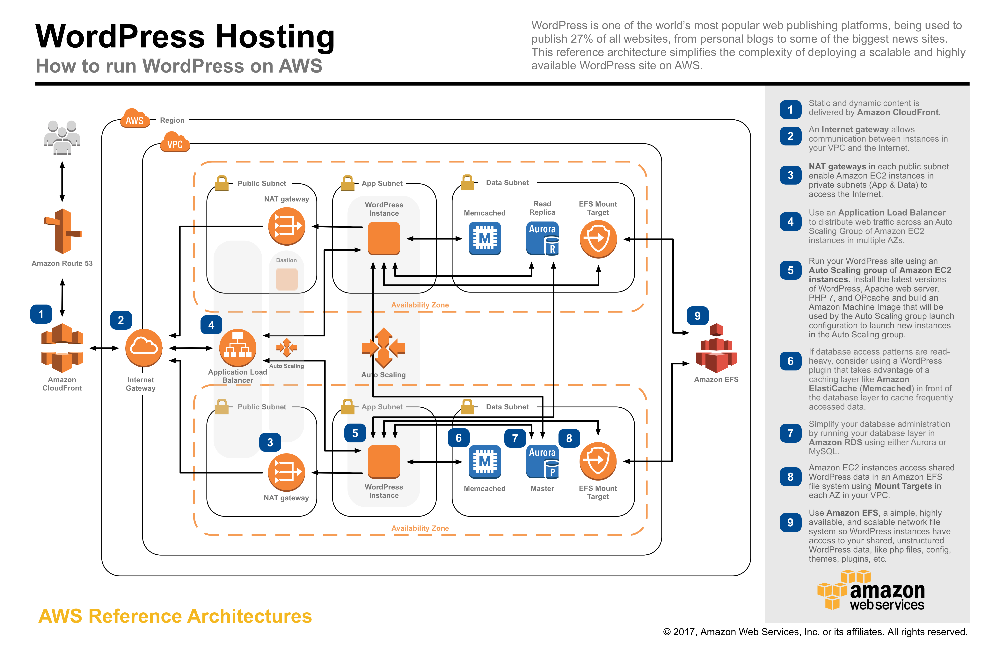

[](http://opensource.org/licenses/MIT)
[]()

# WordPress AWS Best Practice Module
This repo contains a set module in the wordpress folder for deploying a fully redundant and highly available WordPress site.
The module createse a new VPC with an internet gateway and a routing table.

> Please check [CHANGELOG](CHANGELOG.md) for future features and/or bug fixes.

## Usage
* An example for using this module exists in the [examples](examples/) folder.
* Fetch certificate in case you want to use SSL on NLB. Uncomment "listener" parameter under aws_elb in network.tf
* As terraform currently cannot create a key pair, please create one manually. Afterwards download the private key `
  to your root module folder at "./ssh". Set "ec2_key_name" variable to the same filename (without PEM file prefix).

An example of using the module in existing code:
```ruby
module "wordpress" {
  source = "git::https://github.com/pixelicous/terraform-aws-wordpress.git?ref=master"

  region = "${var.region}"
  jumpbox_ip = "142.142.142.142"
  ec2_key_name = "wordpres"
  s3_bucket_name = "wordpress-elb-logs-somesite"
  route53_record_name = "wordpressweb"
  route53_zone_id = "XXXXXXXXXXXXXX"
  rds_db_identifier = "wpsomesitedb"

  tags = "${var.tags}
}
```

## Architecture
The architecture is based of AWS' WordPress deployment best practices which can be found here:



## Information about EC2 VM deployment
* The EC2 AMI is based of Bitnami's Debian WordPress installation.
After EC2 is provisioned the following configuration steps will be executed:
1. MySQL database will be backed up and copied to Amazon RDS, wp-config.php on EC2 will be set accordingly.
2. The local MySQL service will be stopped and disabled.
3. The "WP Offload Media Lite" for Amazon S3 will be installed and activated.

This step runs as part of a "null resource", in order to wait for EC2, RDS and related security groups to be provisioned first.


## References
* https://github.com/aws-samples/aws-refarch-wordpress
* https://d1.awsstatic.com/whitepapers/wordpress-best-practices-on-aws.pdf

## Authors
Module managed by [Netzer Rom](https://github.com/pixelicous).

## License
MIT Licensed. See LICENSE for full details.
